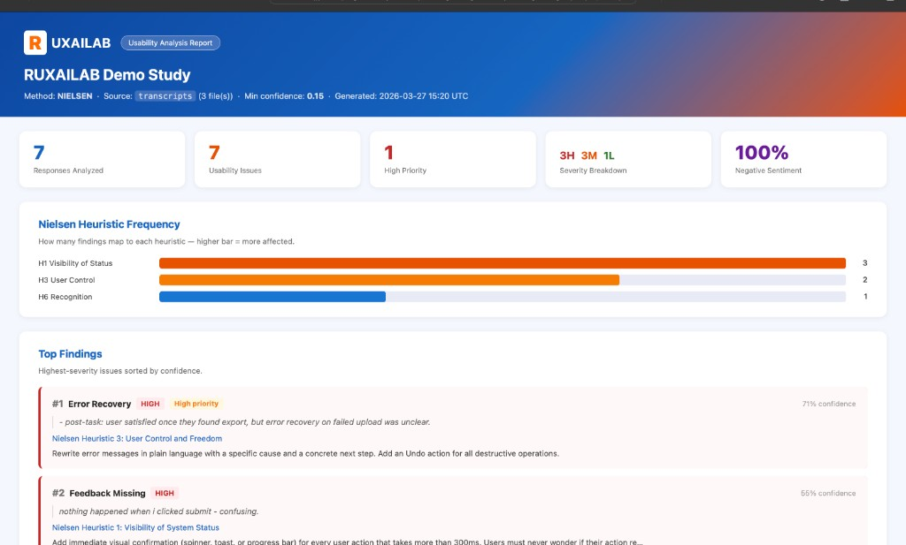
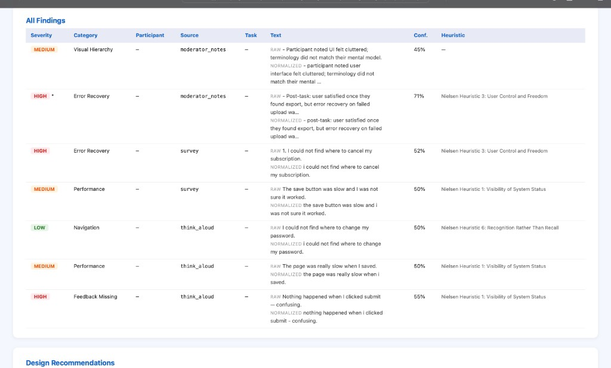
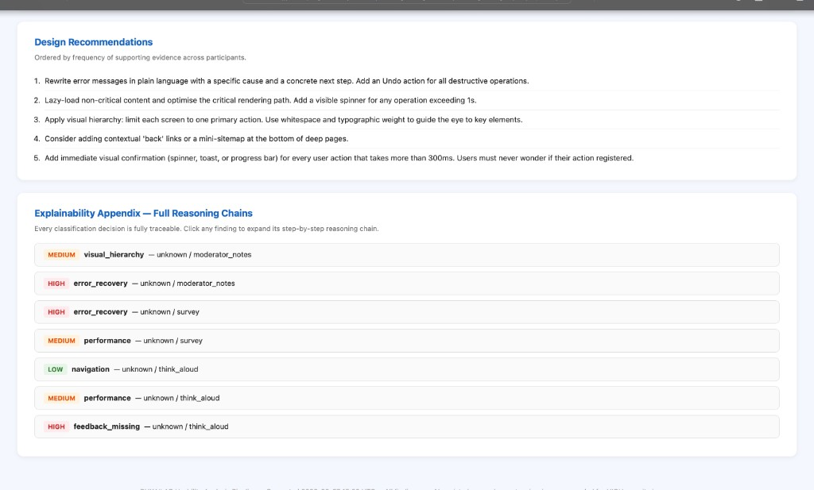

# RUXAILAB — NLP Engine for Usability Test Analysis

> Proof-of-work prototype for the GSoC 2026 project:
> "AI-Driven NLP Engine for Usability Test Results Analysis"

---

## Why This Exists

RUXAILAB is a Vue + Firebase platform for remote usability testing. It handles studies, heuristic evaluations, user answers, and report generation — and it does this well.

But there is a concrete gap at the data layer.

Recent additions to the codebase (notably `AudioSentiment` and `Transcriptions`) introduce AI-adjacent data surfaces. Transcription data now enters the system, but there is no service responsible for cleaning it, normalizing it to a consistent schema, or preparing it for any downstream analysis. Normalization logic is fragmented across model and controller boundaries.

The result: raw text goes in, and researchers still have to interpret it manually.

**This engine closes that gap.**

---

## What the Engine Does

It takes raw usability text — think-aloud transcripts, open-ended survey answers, moderator notes — and produces structured, explainable usability insights.

```
Raw text input
     │
     ▼
┌─────────────────────┐
│  Text Normalization │  ← source-aware cleaning (think-aloud vs survey vs notes)
└────────┬────────────┘
         │
         ▼
┌─────────────────────┐
│  Semantic Analysis  │  ← 3-layer signal extraction
│                     │    Layer 1: Phrase detection
│                     │    Layer 2: Category + sentiment inference
│                     │    Layer 3: Severity + task signal reasoning
└────────┬────────────┘
         │
         ▼
┌─────────────────────┐
│  Methodology Layer  │  ← Nielsen heuristic mapping, SUS scoring, NASA-TLX
└────────┬────────────┘
         │
         ▼
┌─────────────────────┐
│  Explainability     │  ← reasoning chain, evidence, recommendation
└────────┬────────────┘
         │
         ▼
  Structured JSON + HTML Report
  (ready for RUXAILAB report integration)
```

---

## Why Not Generic Sentiment Analysis

This is the core design argument.

| Generic NLP | This Engine |
|---|---|
| `"Negative: 67%"` | `Heuristic 6: Recognition over Recall` |
| Black-box output | Full reasoning chain per finding |
| Sentiment polarity | Usability issue category (8 types) |
| Single score | Severity (HIGH / MEDIUM / LOW) + task signal |
| No UX grounding | Mapped to Nielsen, SUS, NASA-TLX |
| Not actionable | Includes concrete design recommendation |

**Example — same transcript, two outputs:**

*Input:* `"I had no idea where the settings were. I clicked around for a while and finally found it buried in the profile menu."`

```
Generic sentiment:
  → Negative (0.61)

This engine:
  → issue_category:  navigation
  → nielsen:         Heuristic 6 — Recognition over Recall
  → severity:        MEDIUM
  → task_signal:     task_delay
  → evidence:        ["no idea where", "took me a while to find", "buried"]
  → reasoning:       navigation → Heuristic 6 → MEDIUM (delayed, not blocked)
  → recommendation:  "Expose Settings in primary navigation or persistent header"
  → confidence:      0.81
```

That is the difference between a sentiment tool and a usability insight engine.

---

## Project Structure

```
ruxailab-nlp-engine/
├── analyze.py                       # CLI entrypoint → JSON or HTML
├── ingestion.py                     # transcript / CSV → flat record dicts
├── report_generator.py              # HTML report builder
├── ruxailab_nlp.py                  # text normalization + Nielsen + SUS + TLX (unified imports)
├── explainability.py                # semantic analysis + XAI engine (SemanticAnalyzer, reasoning chain)
├── semantic_analysis.py             # 3-layer rule-based signal extractor (tests / legacy path)
├── text_normalizer.py               # source-aware cleaning + NormalizedRecord
├── ruxailab_methodology.py          # Nielsen / SUS / NASA-TLX core
├── nielsen_mapper.py                # issue_category → heuristic list (report / JSON)
├── transcripts/
│   ├── think_aloud_session1.txt
│   ├── survey_responses.csv
│   └── moderator_notes.txt
├── output/                          # generated reports (gitignored except .gitkeep)
├── docs/images/                     # README screenshots (sample HTML report)
├── tests/
└── README.md
```

## Demo pipeline (ADIM 5)

```
transcripts/
  ├── think_aloud_session1.txt   → profile: think_aloud (transcription-style cleanup)
  ├── survey_responses.csv       → profile: survey (CSV columns: record_id, text)
  └── moderator_notes.txt        → profile: moderator_notes (study text)
           │
           ▼
   text_normalizer  →  explainability (XAI)  →  nielsen_mapper
           │                    │                    │
           └────────────────────┴────────────────────┘
                                ▼
                      report_generator
                                ▼
                    output/report.html
```

---

## Sample HTML report

Below: screenshots from `python3 analyze.py --input transcripts/` (example title *RUXAILAB Demo Study*). Open **`output/report.html`** locally after running the CLI for the interactive version (expandable reasoning chains, print layout).

### Study overview

Header, KPI row, Nielsen heuristic frequency chart, and top findings.



### All findings

Full table with severity, category, source, raw vs normalized text, confidence, and heuristic mapping.



### Recommendations and explainability

Study-level design recommendations and the explainability appendix (full reasoning chains per finding).



---

## Implemented: `semantic_analysis.py`

The core signal extraction module is already built.

**3-layer architecture:**

**Layer 1 — Phrase Detection**
Pattern matching across 8 UX issue categories with 50+ domain-specific phrases. Uses regex boundary matching, not naive `in` substring checks.

**Layer 2 — Signal Inference**
Category resolved by vote counting across all matched rules (most-evidenced category wins, not first-match). Asymmetric sentiment: negative overrides positive, because UX text is not symmetric.

**Layer 3 — Context Reasoning**
Severity derived from a documented decision table (not nested conditionals). Task signal classified as `task_success / task_failure / task_delay / unknown` with priority ordering.

**Confidence scoring:**
```
confidence = min(signal_density_score + category_coherence_score, 1.0)
```
Rewards both quantity of evidence and consistency of category signal.

---

## Issue Categories

| Category | What it captures |
|---|---|
| `navigation` | User cannot find elements, lost in the interface |
| `terminology` | Labels, copy, or naming causes confusion |
| `visual_hierarchy` | Elements not seen, missed, or hard to locate visually |
| `feedback_missing` | User does not know if an action worked |
| `form_friction` | Input-related friction: length, validation, re-entry |
| `performance` | Slowness, lag, unresponsiveness |
| `trust_clarity` | Security concerns, unofficial feeling |
| `error_recovery` | User is stuck, cannot undo, crashed |

---

## Nielsen Heuristic Mapping (in progress)

```
navigation       → H6: Recognition over Recall
terminology      → H2: Match between system and real world
feedback_missing → H1: Visibility of system status
error_recovery   → H5: Error prevention + H9: Help users recognize errors
form_friction    → H8: Aesthetic and minimalist design
visual_hierarchy → H8: Aesthetic and minimalist design
performance      → H1: Visibility of system status
trust_clarity    → H10: Help and documentation
```

---

## Integration Fit with RUXAILAB

This engine is designed to slot into RUXAILAB's existing architecture without requiring structural changes.

- **Input:** Reads from `Transcriptions` and `AudioSentiment` model shapes already present in the codebase
- **Output:** Produces structured JSON that maps directly to RUXAILAB's report generation layer
- **No new dependencies required** for the rule-based core (pure Python)
- **Optional LLM enhancement layer** can be toggled on without changing the pipeline contract

---

## Usage

Run from the repo root (modules live alongside `analyze.py`). See `analyze.py` module docstring for the full pipeline (ingest → `ruxailab_nlp.normalize_text` → `SemanticAnalyzer` → `ExplainabilityEngine` → aggregate → HTML/JSON).

```bash
cd ux-insight-engine

# Full demo (default output: output/report.html)
python3 analyze.py --input transcripts/

# Explicit HTML path + title + confidence floor
python3 analyze.py -i transcripts/ -o output/report.html --title "Q4 Study" --min-confidence 0.2

```

After a successful run, open **`output/report.html`** in a browser for the full report (KPI row, heuristic chart, findings, recommendations, and optional raw text / reasoning appendix). That file is produced locally under `output/` (gitignored except `.gitkeep`).

Unit tests: `python3 -m unittest discover -s tests -p 'test_*.py' -t .` (the `-t .` flag puts the project root on `sys.path`).

- **HTML**: `report_generator.generate_html_report` — study summary, per-finding cards, pipeline meta in the header; flags `--no-reasoning` / `--no-raw-text`.

Regenerate **`output/report.html`** after pulling (that path is gitignored except `output/.gitkeep`).

---

## Roadmap

This prototype covers the rule-based foundation. The GSoC engagement would extend it to:

1. **Hardened normalization** — source-aware cleaning for all RUXAILAB input types
2. **Full methodology suite** — SUS scoring, NASA-TLX workload analysis
3. **LLM hybrid layer** — for utterances that rule-based misses (low confidence fallback)
4. **RUXAILAB integration** — API endpoint + Firebase-compatible output schema
5. **Evaluation suite** — precision/recall against manually labeled usability sessions

---


**Main modules:** `text_normalizer.py`, `semantic_analysis.py`, `explainability.py`, `ruxailab_methodology.py`, `nielsen_mapper.py`, `ruxailab_nlp.py`, `report_generator.py`, `analyze.py` (CLI). SUS and NASA-TLX live in `ruxailab_methodology.py` (tests call them directly).

---

## Author

GSoC 2026 applicant — RUXAILAB / NLP Engine track